# ⚡ Awesome Spot Instance Automation ☁️

  
  
  
  
  
  
  

---

## 🚀 Overview & Ecosystem

A curated list of top-tier **SaaS platforms**, **Karpenter node provisioners**, and **open-source FinOps tools** dedicated to **Spot & Preemptible Instance Automation**, Kubernetes node autoscaling, cost optimization, and interruption resilience across AWS, Azure, GCP, and multi-cloud environments.

These tools enable engineering teams, DevOps, and cloud financial managers (FinOps) to run compute workloads at up to **90% discount** while maintaining high availability through intelligent capacity diversification, ML interruption forecasting, and rapid fallback to on-demand instances.

---

## 📊 Market Analysis & Sector Dynamics

> 💡 **Market Size & Structure**: The global Cloud Financial Management (FinOps) & Kubernetes Cost Optimization market is estimated at **$10.5 Billion – $14.2 Billion** (projected to exceed $20 Billion by 2030 at ~18% CAGR). The sector is **moderately to highly fragmented**: cloud hyper-scalers (AWS, GCP, Azure) provide raw spot primitives, while specialized FinOps vendors (Spot by NetApp, CAST AI, Zesty, ScaleOps) compete aggressively on automated ML rightsizing, preemption forecasting, and SLA guarantees without a single winner-take-all monopoly.

---

## 🏢 Top SaaS & Hosted Platforms

*Sorted by Company Scale / Valuation (Descending)*

| Product | Description | Company Scale / Valuation | Pricing (Starting Tier) | Free Tier / Trial Limits |
| :--- | :--- | :--- | :--- | :--- |
| **[Spot by NetApp (Ocean)](https://spot.io/)** | Enterprise platform for automated spot workload scaling, bin-packing, interruption handling, and SLA guardrails. | **$15B+ Market Cap** (Parent NetApp; acquired Spot.io for $450M) | Starts at 15–20% of net savings (or ~\$0.001/vCPU-hr via AWS Marketplace). | 14-day free trial with full platform features. |
| **[Zesty](https://zesty.co/)** | Automated cloud compute, storage, and commitment optimization (Zesty Disk & Spot/RI automation). | **$350M+ Valuation** ($120M+ Raised) | Starts at 25% of net cloud cost savings achieved (success-based billing). | Free initial Cloud Savings Analysis & ROI report. |
| **[CAST AI](https://cast.ai/)** | Kubernetes cost optimization platform automating Karpenter provisioning, rightsizing, and spot management. | **$300M+ Valuation** ($73M+ Raised) | Starts at \$0.0069 per managed CPU/hr (~\$5/CPU/month) or \$200/mo minimum tier. | Free forever Read-Only Cost Monitoring plan (unlimited nodes & clusters). |
| **[ScaleOps](https://scaleops.io/)** | Autonomous Kubernetes cloud cost optimization, real-time pod rightsizing, and dynamic node scaling. | **$200M+ Valuation** ($58M+ Raised) | Starts at \$5.00 per vCPU/month (or ~\$0.0069/vCPU-hr). | 7-day free trial with full automated rightsizing features. |
| **[nOps](https://www.nops.io/)** | Automated FinOps platform for AWS Spot instance orchestrations, cost allocation, and commitment management. | **~$120M Est. Valuation** ($30M+ Raised) | Starts at \$199/month for Core platform (or 15% of net Spot savings). | Free Tier (basic visibility & reporting) + 14-day trial for full automation. |
| **[StormForge](https://www.stormforge.io/)** | Continuous ML-driven Kubernetes workload optimization and resource requests rightsizing. | **~$80M Est. Valuation** ($20M+ Raised) | Starts at \$0.0041 per CPU/hr (~\$3/pod/month). | 30-day free trial (up to 1 cluster with full optimization). |
| **[PerfectScale](https://www.perfectscale.io/)** | Autonomous Kubernetes capacity management, pod rightsizing, and cluster waste detection platform. | **~$40M Est. Valuation** ($10M+ Raised) | Starts at \$0.005 per vCPU-hr for Advanced/Expert paid plans. | Free forever Community Edition (up to 300,000 vCPU-hours/month) & 30-day trial for Expert features. |
| **[CloudPilot AI](https://cloudpilot.ai/)** | AI-driven Kubernetes node provisioning, Spot instance selection, and workload optimization platform. | **~$15M Est. Valuation** ($5M Seed / Early Stage) | Starts at \$0.003 per CPU core-hour for Standard plan. | Free forever Community Edition (open-source engine with auto node sizing) & 30-day trial for Standard features. |

---

## 🔓 Open-Source GitHub Projects

*Sorted by Star Count (Descending)*

- 🛠️ **[Infracost](https://github.com/infracost/infracost)**   
  Cloud cost estimates for Terraform, Pulumi, and IaC pull requests before deploying spot or on-demand infrastructure.

- ⚡ **[KEDA](https://github.com/kedacore/keda)**   
  Event-driven Kubernetes autoscaling component. Scales containers from zero to burst capacity seamlessly alongside Karpenter and Spot instances.

- 📈 **[Kubernetes Cluster Autoscaler](https://github.com/kubernetes/autoscaler)**   
  Official Kubernetes autoscaler for scaling node groups up and down across AWS, GCP, and Azure with mixed-instance spot group policies.

- 🚀 **[Karpenter AWS Provider](https://github.com/aws/karpenter-provider-aws)**   
  Next-generation, high-speed Kubernetes node provisioner. Dynamically launches right-sized EC2 Spot instances, handles consolidation, and optimizes fallback.

- 💰 **[OpenCost](https://github.com/opencost/opencost)**   
  CNCF Sandbox project providing real-time Kubernetes workload cost monitoring, allocation, and Spot vs On-Demand savings tracking.

- 🧹 **[Descheduler](https://github.com/kubernetes-sigs/descheduler)**   
  Rebalances and evicts Kubernetes pods to consolidate workloads onto cheaper spot capacity or newly launched right-sized nodes.

- 🤖 **[Robusta](https://github.com/robusta-dev/robusta)**   
  Automation platform for Kubernetes monitoring, Prometheus alert enrichment, and automated spot node termination incident response.

- 💡 **[AutoSpotting](https://github.com/LeanerCloud/AutoSpotting)**   
  Replaces on-demand instances in AWS Auto Scaling groups with equivalent Spot instances dynamically, with zero config changes and fallback handling.

- 🏗️ **[Crane](https://github.com/gocrane/crane)**   
  FinOps platform for Cloud Resource Analytics and Economics in Kubernetes, featuring recommendation engines and spot capacity scheduling.

- 🛡️ **[AWS Node Termination Handler](https://github.com/aws/aws-node-termination-handler)**   
  Gracefully handles EC2 Spot interruption notices, rebalance recommendations, and scheduled maintenance events inside Kubernetes clusters.

- 📊 **[kubectl-cost](https://github.com/kubecost/kubectl-cost)**   
  CLI plugin to inspect real-time Kubernetes cluster cost allocation, pod compute spending, and spot instance efficiency directly from terminal.

- ☁️ **[Karpenter GCP Provider](https://github.com/cloudpilot-ai/karpenter-provider-gcp)**   
  Community provider bringing Karpenter-style high-speed provisioning and Preemptible VM automation to Google Cloud Platform (GCP).

- 📦 **[Instance Manager](https://github.com/keikoproj/instance-manager)**   
  Kubernetes controller for creating, managing, and lifecycle-monitoring worker node instance groups across cloud providers.

---

## 🤝 How to Contribute

1. Fork this repository.
2. Add or update entries following the clean tabular and badge formatting.
3. Ensure pricing and free tier/trial limits are specific and verifiable.
4. Submit a Pull Request!

Check out [Awesome-Awesome-Awesome](https://github.com/ishandutta2007/Awesome-Awesome-Awesome) for more curated lists!

---

## 📈 Star History

---

## ⚠️ Disclaimer

- This is a community-curated list for educational and FinOps research purposes.
- Spot and preemptible instances can be reclaimed with a 30-second to 2-minute notice. Ensure workloads are stateless, checkpointable, or protected by PodDisruptionBudgets and fallback capacity.

---

**Made with ❤️ for Platform Engineers, FinOps teams, and Kubernetes Operators.**
